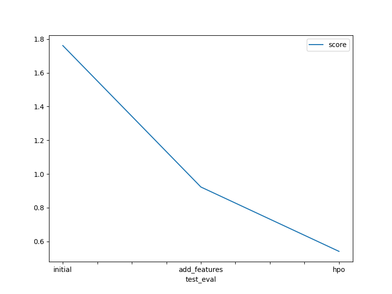

# Report: Predict Bike Sharing Demand with AutoGluon Solution
#### KHANG HOANG TRAN

## Initial Training
### What did you realize when you tried to submit your predictions? What changes were needed to the output of the predictor to submit your results?

The score point returned by Kaggle's evaluation is too low. As the figure from the Notebook, it is only `1.76207`. The metric to evaluate the model is used in this competition is **Root Mean Squared Logarithmic Error (RMSLE)**. The better performance in this metric, the higher score we obtain. 
So we need to improve our *Training Data* and  *hyperparameter in model**, apply some changes to original features  with deep analysis and understanding.

### What was the top ranked model that performed?
`WeightedEnsemble_L3` provides the highest score through all regression models, in all 3 cases ("initial", "add_features", "hpo")

## Exploratory data analysis and feature creation
### What did the exploratory analysis find and how did you add additional features?
With EDA techniques, we could see that:
- A column name "datetime" with `datetime64`, we can extract into multiple smaller features. i.e `day`, `month`, `year`, etc, ...
- Make categorical columns with exact type "category", which evalate Autogluon model for better learning.
- We could create `time_elapsed` features for train datasets, but i don't think time series is relevant much in this case, the chart in notebook illustrate that.

### How much better did your model preform after adding additional features and why do you think that is?
- Extract "datetime" features into many meaningful numbers help **Regression model** understand better our data, then learn quicker with better performance. 
- Normalizing also has the meaning of helping Regression-family model have a better vision, scan our dataset as numerical value.

## Hyper parameter tuning
### How much better did your model preform after trying different hyper parameters?
Significantly, from `1.76207` (initial) to `0.9226` (new features) in score, with training times are slightly increased, from `42.92962023` mins (initial) to `46.60203587` mins (new features).

### If you were given more time with this dataset, where do you think you would spend more time?
Investigate more about domain knowleges, transform dataset in a way that uses experience in that sector.
Research methods to select most important features, shows another stastics or many beautiful charts to have a deeper insight into provided datasets.

### Create a table with the models you ran, the hyperparameters modified, and the kaggle score.
|model|hyperparameter_tune_kwargs|hpo2|hpo3|score|
|--|--|--|--|--|
|initial|None|NaN|NaN|1.76207|
|add_features|None|NaN|NaN|0.92260|
|hpo|auto|NaN|NaN|0.54057|

### Create a line plot showing the top model score for the three (or more) training runs during the project.

### Create a line plot showing the top kaggle score for the three (or more) prediction submissions during the project.

## Summary
`Biking Sharing Demand` is not too complicated to understand from very beginning, but it is quite challenge if we want to investigate more into improve the resulting score, add more features, consider to remove unnecessary ones.

Datasets is large enough (`10886` in train, `6493` in test) with a variety of total `12` features for us to think about and filter a lots of them. Our submitted score `0.54057` shows relative corrects in predictions with *their private test dataset*. 

`WeightedEnsemble_L3` is the most well-suited model in all experiments; and the gradually higher score was achieved when we respectively apply what we learn, i.e *Exploratory Data Analysis (EDA)* --> Then apply *Hyperparameter Tuning*. This shows that the theory we apply is correct.