# Project Report

## Project Folder Structure

Working space:

<p align="center">
    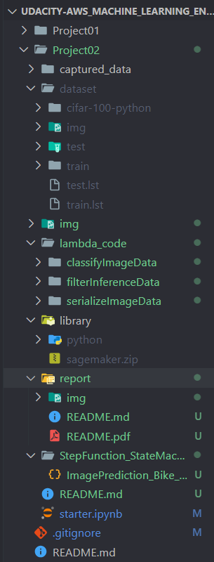
</p>

## Service Set Up
After creating dataset, executing training job to create model, deploying endpoint and storing all output. We create 3 main **lambda functions**

- `serializeImageData`
- `classifyImageData`
- `filterInferenceData`

<p align="center">
    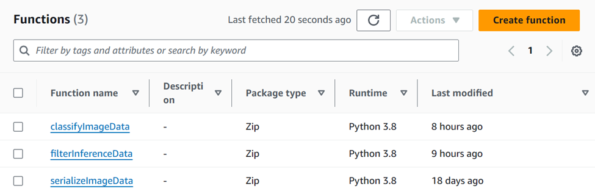
</p>

For `classifyImageData`, the predicting process is supposed to last longer. We set the timeout to **1 minute** (Default is 3 seconds)

<p align="center">
    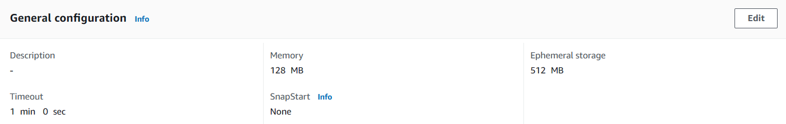
</p>

We also create layer that is already installed with "sagemaker" module and attached to function `classifyImageData`. This allows to run Python3.8 Runtime with custom libraries.

<p align="center">
    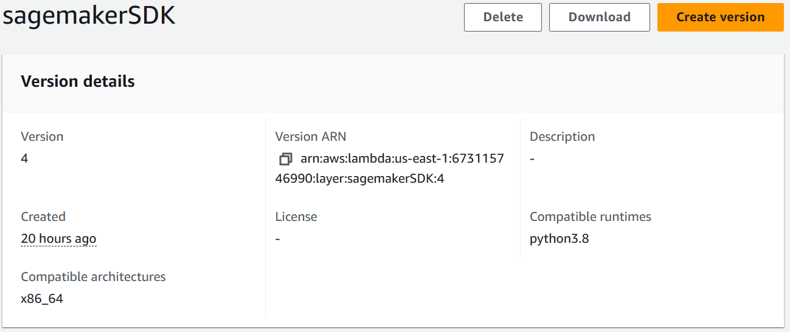
</p>


All functions we use the same role `Project02-khangtictoc` with necessary policy for easy deployment task. 

<p align="center">
    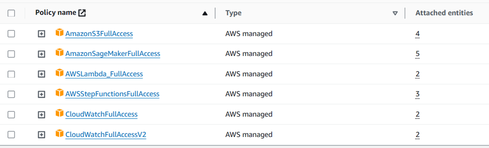
</p>

> **Note**: `CloudWatchFullAccess` and `CloudWatchFullAccessV2` are for debugging lambda functions

Trust Entities:

```json
{
	"Version": "2012-10-17",
	"Statement": [
		{
			"Effect": "Allow",
			"Principal": {
				"Service": [
					"lambda.amazonaws.com",
					"states.amazonaws.com",
					"sagemaker.amazonaws.com"
				]
			},
			"Action": "sts:AssumeRole"
		}
	]
}
```

Our **Step Function** 's diagram:

<p align="center">
    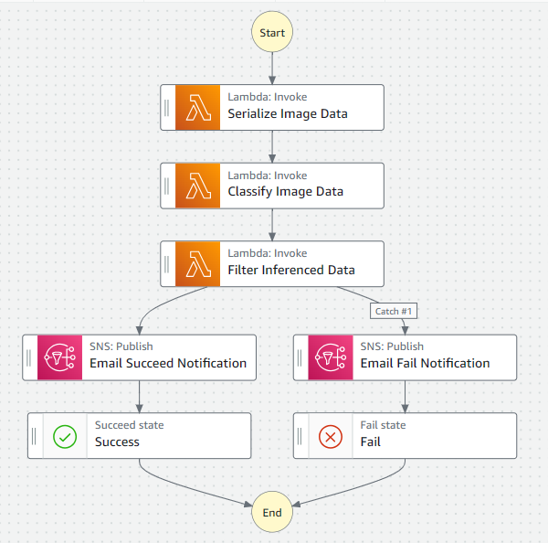
</p>

The workflow performs following tasks:
- Serialize data of input image file by *base64 encoding*
- Deserialize data and transfer all raw image data into deployed endpoint for inferences
- Filter and evaluate the result if they are matched defined conditions:
  - `Yes` => Send email notification with **Successful** status
  - `No` => **Exception Handling**, catching the error "States.Taskfailed " => Send email notification with **Failed** status => Stop the workflow 

For the first state, we pass JSON payload as input as project mentioned. The next 2 states, we pass the input from the output from previous states.

For "Email Notification", we use **SNS service** to publish email message to my personal email account. Create a simple **Standard Topic**:

<p align="center">
    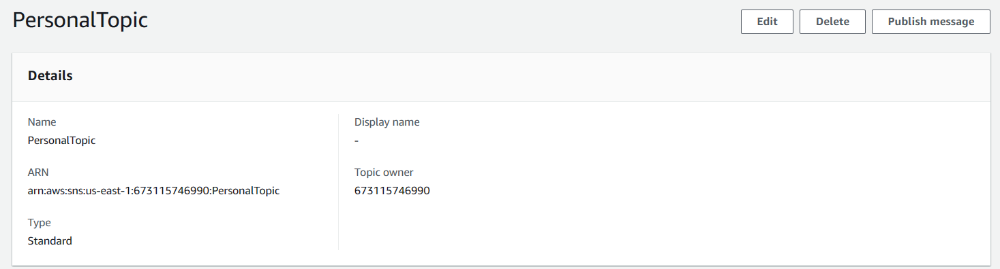
</p>

Create "Subscription" associated with above topic:

<p align="center">
    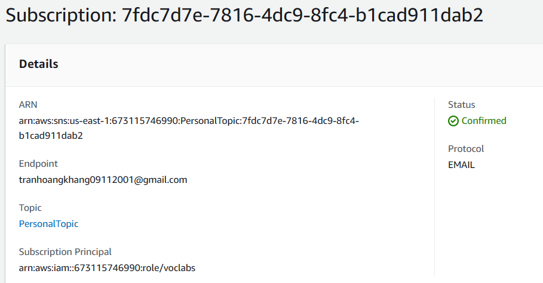
</p>

## Result & Evaluation

Try a sample that producing inferences that meets `THRESHOLD`

<p align="center">
    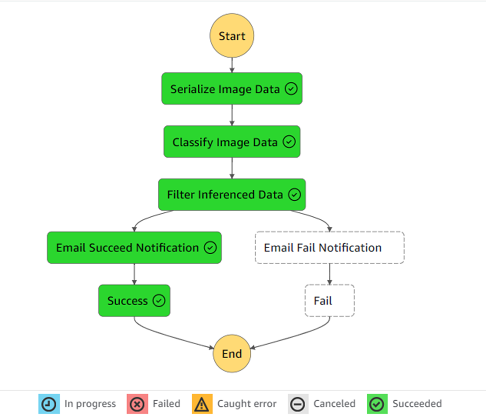
</p>

Try a sample that producing inferences that **DOES NOT** meets `THRESHOLD`

<p align="center">
    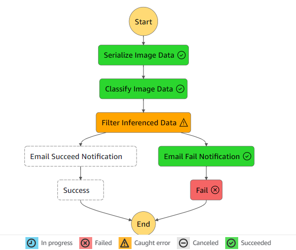
</p>

Inputs & Output of a successful execution:

Similar to each other, i.e, for state `Classify Image Data`

<p align="center">
    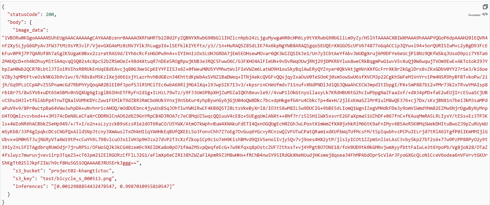
</p>

Inputs & Output of a failed execution:

Same as successful one, the prominent difference lies in "Error Handling"

<p align="center">
    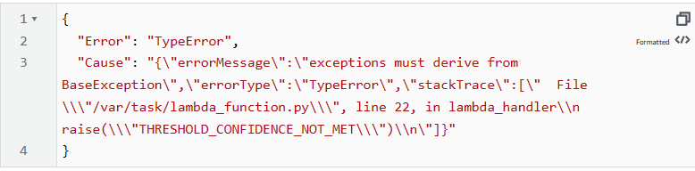
</p>

Output of whole Step function:

<p align="center">
    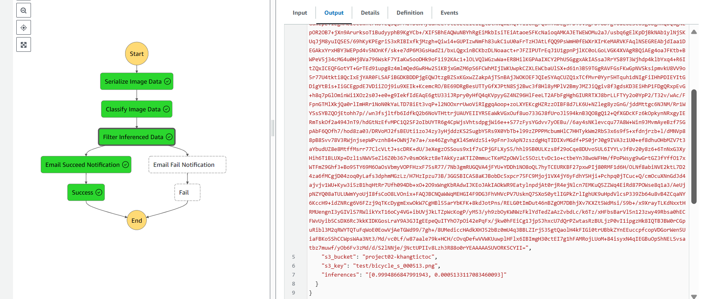
</p>

Email of successful execution:

<p align="center">
    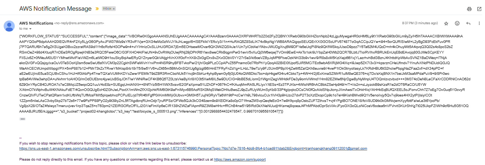
</p>

Email of failed execution:

<p align="center">
    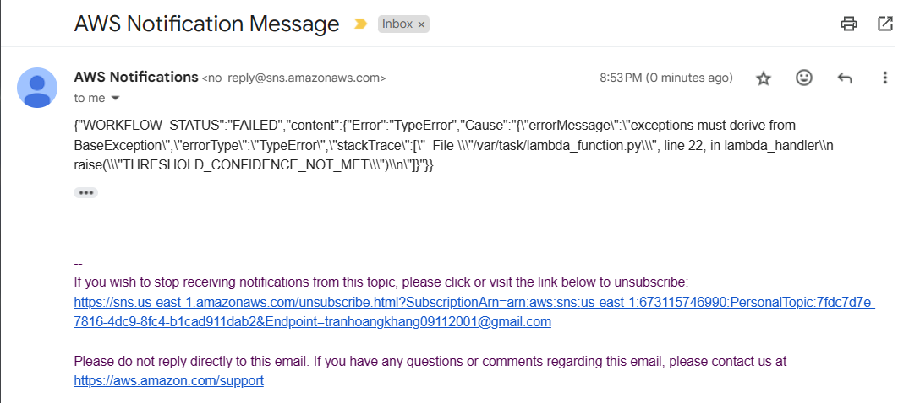
</p>

Confidence point:

<p align="center">
    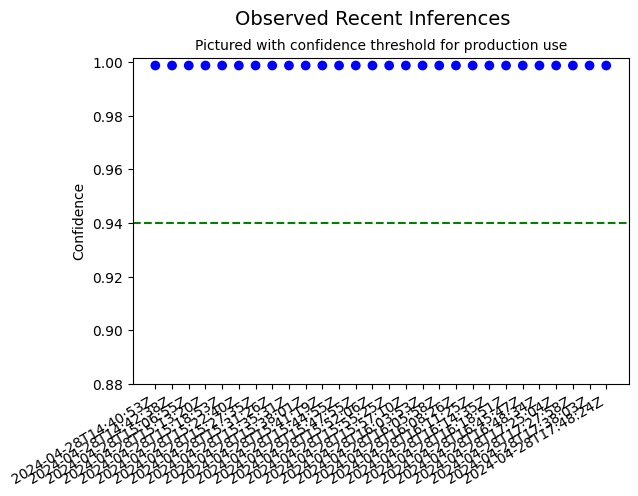
</p>